<b><h3>[1. Project description](#description)</h3></b>

<b><h3>[2. Implemented Details](#details)</h3></b>

- [Making an HTTP request (cy.request()) for API test with testing response data](#httprequest)

- [Making Interception (cy.intercept()) to intercept, stub, spy and mock an API call](#interception)

- [Parametrizing](#parametrizing)

- [Data driven concepts from fixtures and from API Resources](#datadriven)

- [Configuration changes in Cypress.config.js](#config)

- [Generating Reports](#reports)

<!-- - [Cypress Dashboard](#dashboard) - -->


<a id="description"></a>
## __1. Project description__

This is a Cypress Javascript based project for API test automation built using Data Driven concepts for API resources and Data payload for requests in JSON format from external resources with generating reports with updating configs for recording results in Cypress dashboard.

At the moment, the added API tests (as an example) have been directed to verify basic API calls (POST, GET, PUT, DELETE) using cy.request() with the test for verifying E2E scenario from the user creation, data updating till user deletion ([_userE2EChainTest.js_](https://github.com/andrey-yudin-7/CypressAPIFramework/blob/master/cypress/integration/APITests/userE2EChainTest.js)). 

Also added the test for using Cypress interception (cy.intercept() intercepts requests at the network layer) to intercept, stub, spy or mock an API call ([_Apiintercept.js_](https://github.com/andrey-yudin-7/CypressAPIFramework/blob/master/cypress/integration/Interception/Apiintercept.js))

This project uses the following free REST APIs root resources:
https://gorest.co.in (for _PostUser.js, GetUser.js, PutUser.js, DeleteUser.js, userE2EChainTest.js_)
https://rapidapi.com/apishub/api/yahoo-weather5 (for [_WeatherAPI.js_](https://github.com/andrey-yudin-7/CypressAPIFramework/blob/master/cypress/integration/APITests/WeatherAPI.js))
https://jsonplaceholder.typicode.com (for interception _Apiintercept.js_)

Project Structure:

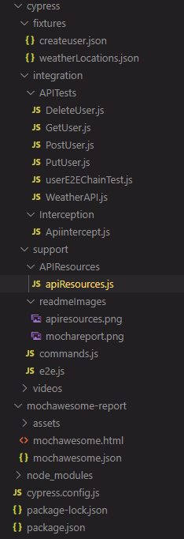

<a id="details"></a>

## __2.Implemented Details__


<a id="httprequest"></a>

### __2.1 Making an HTTP request (cy.request()) for API test with testing response data__ 

Basic information about Http request in Cypress with all supported methods available [here](https://docs.cypress.io/api/commands/request)

In this project in APITests folder created API tests using basic http requests as POST, GET, PUT, DELETE with Request Chaining.

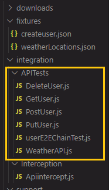

For Example in ([_userE2EChainTest.js_](https://github.com/andrey-yudin-7/CypressAPIFramework/blob/master/cypress/integration/APITests/userE2EChainTest.js)) test is passing through following steps: 


1. User created (with POST method) using data from payload with the response status and body verification.
2. Get created user (with GET method) with the response status and body verification that user's data are from payload.
3. User data updated (with PUT method) with the response status and body verification.
4. Get updated user (with GET method) and verify with the response status that the user now with the updated data.
5. Delete user (with DELETE method) with the response status verification
6. Verify user deleted (with GET method) successfully with the response status and body verification.

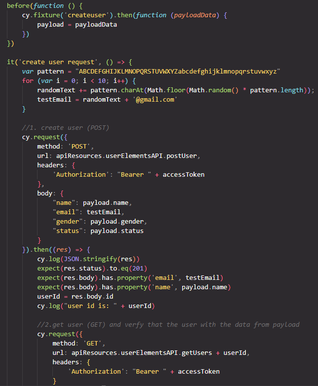


<a id="interception"></a>

### __2.2 Making Interception (cy.intercept()) to intercept, stub, spy or mock an API call__ 

Basic information about Cypress interception available [here](https://docs.cypress.io/api/commands/intercept)

To test interception created [_Apiintercept.js_](https://github.com/andrey-yudin-7/CypressAPIFramework/blob/master/cypress/integration/Interception/Apiintercept.js) test with the main end point https://jsonplaceholder.typicode.com/posts from free APIs available at https://jsonplaceholder.typicode.com/

where we are calling posts:

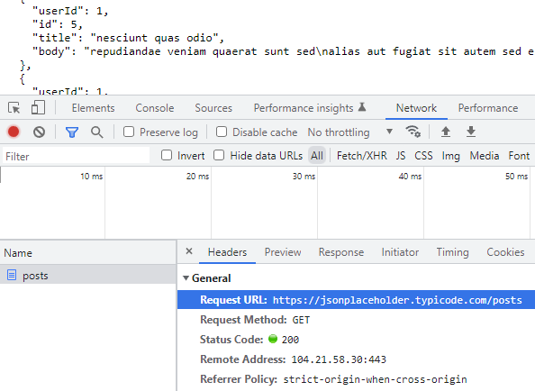

with the following response:

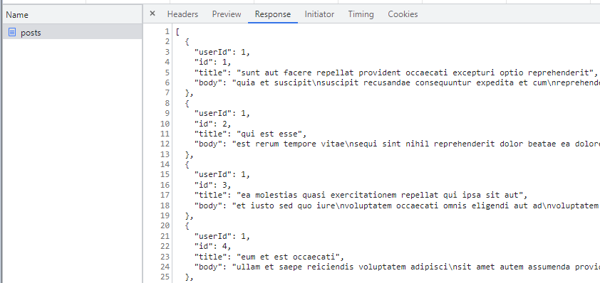

To generate our own response so we can mock it up we are using cy.intercept() method with the path: '/posts', after clicking on element with the /posts href we'll spy on that call using cy.wait(), after that we can work on the response verification.

To create a mock we need to return a static response as { totalpost: 5, name: 'mockup' } through intercept method:

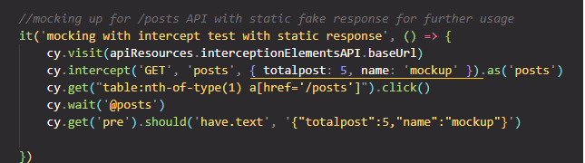

on test execution we should get the response with the static data that we added:

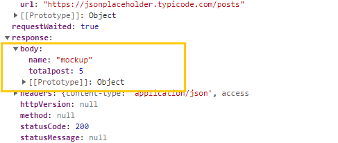

which means that we are successfully mocked API


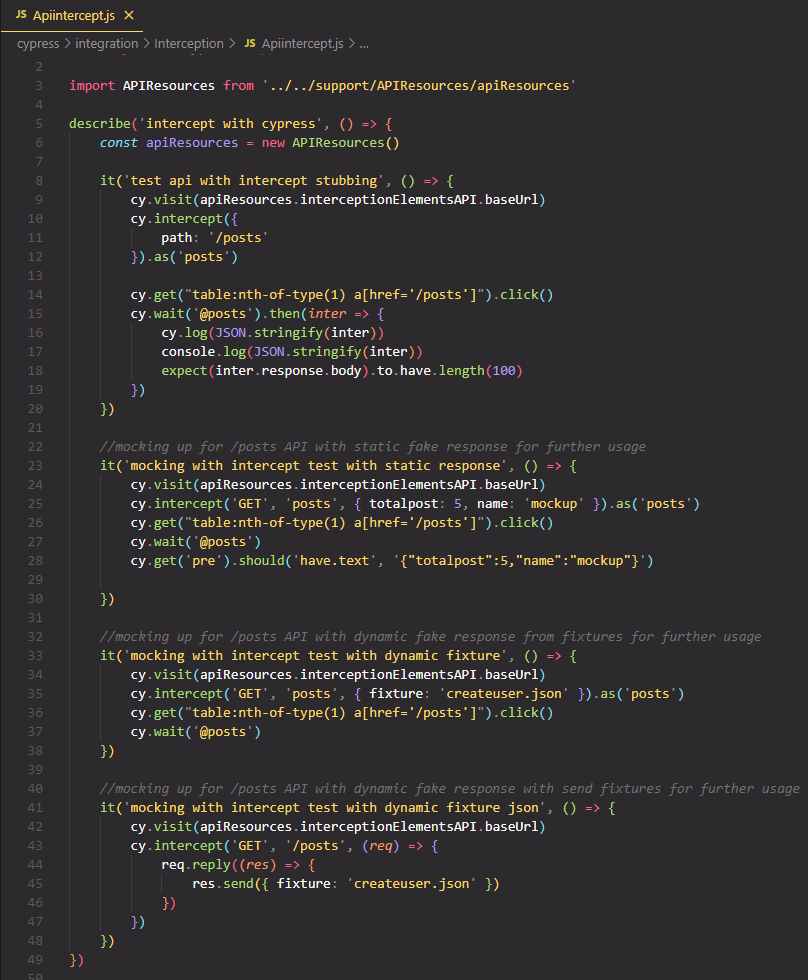

<a id="parametrizing"></a>

### __2.3 Parametrizing__ 

Implemented parametrizing in scripts with different browsers execution(chrome, firefox, edge, electron) for further possible integration with CI pipelines. To run tests with default headlessly mode during cypress run added "test" in scripts, to run tests with forcing the browser to be shown (headed mode) added "headtest" in scripts, to record tests runing in Cypress DashBoard added "recordDashBoardTest" (you'll need to updated the key from XXX to your key provided in Cypress dashboard).

From _package.json_:

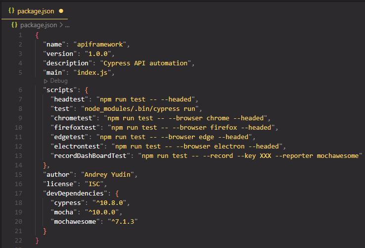

Results from running command:
```
npm run test
```
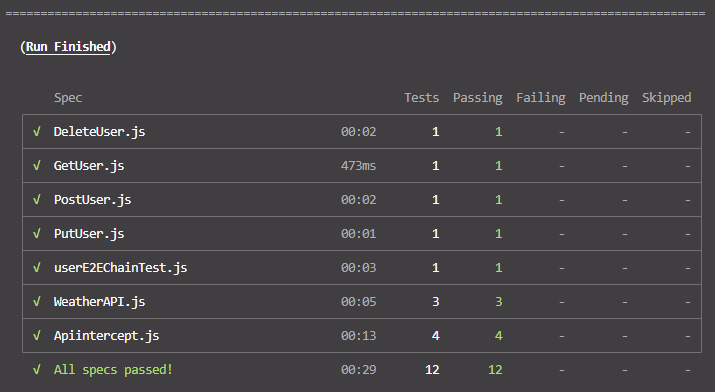

<a id="datadriven"></a>

### __2.4 Data driven concepts from fixtures and from API Resources__ 

Data driven approach (reading data files and storing input values into variables) is implemented by reading from fixtures. 

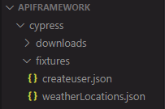

Fixtures enable data-driven automation in Cypress by saving the test data in JSON format:

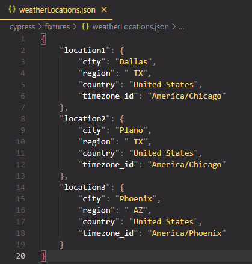

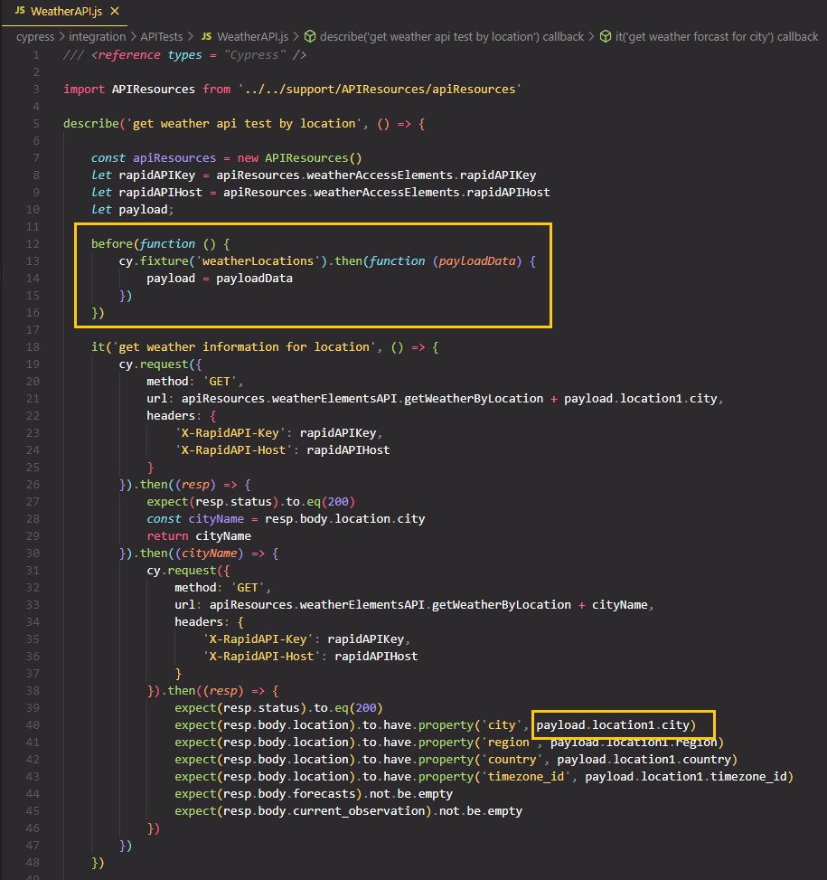

Framework built using the approach to keep API resources separately from test to achieve the following goals for the project:
- easy to maintain project;
- reduce or eliminate duplicacy;
- re-usability of code;
- reliability.

from _apiResources.js_

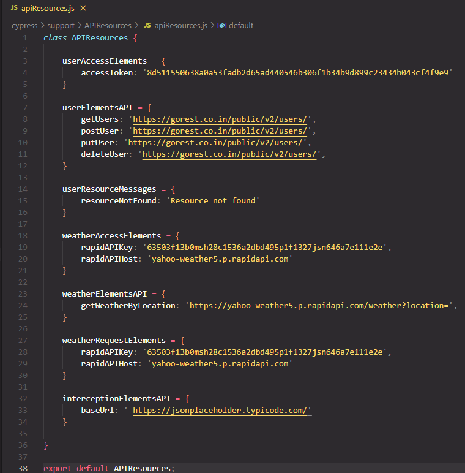

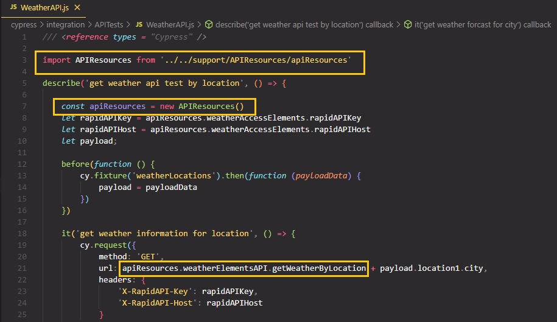

<a id="config"></a>

### __2.5 Configuration changes in Cypress.config.js__

 Created on the first Cypress launching default configuration was updated with specifying projectId required for Cypress Dashboard, specPattern path, screenshotsFolder, changing pageLoadTimeout(time to wait for page transition events) and defaultCommandTimeout (time to wait until most DOM based commands are considered timed out) to 10 seconds, mochawesome reporter as an alternative report for Cypress Dashboard, also was defined a global env url with adding the number of times as 1 to retry a failing test (retries).

 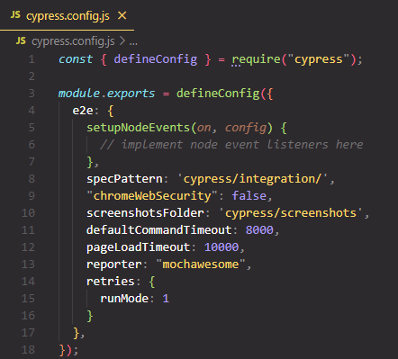


<a id="reports"></a>

### __2.6 Generating Reports__

Integrated Mochawesome report for local usage as an alternative to the deep reporting mechanisme available on using Cypress dashboard.
Cypress is bundled with Mocha, so any reports that can be generated for Mocha can also be utilized with Cypress.

Implementation in cypress.config.js:

```
    reporter: "mochawesome"
```

After execution is completed, the mochawesome-report folder gets generated within the Cypress project containing reports in html and json formats.

 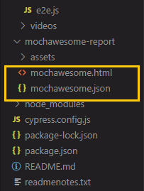

Right-click on the mochawesome.html report, select the Copy Path option, and open the path copied on the browser.

 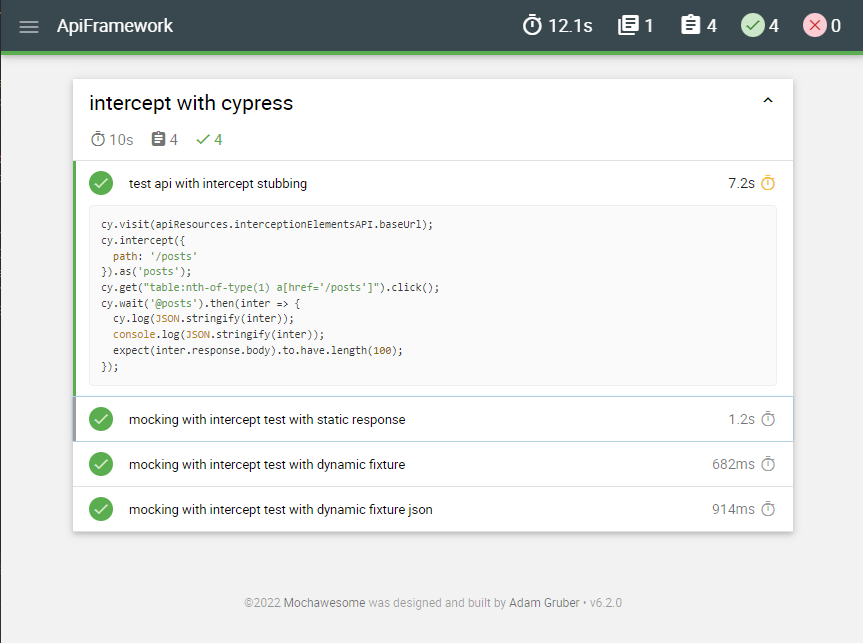

<!-- 

<a id="dashboard"></a>

 ### __2.7 Cypress Dashboard__ -->


 <!-- Parallelize your tests in CI and visualize every error by watching full video recordings of each test you run. -->