<b><h3>[1. Project description](#description)</h3></b>

<b><h3>[2. Implemented Details](#details)</h3></b>
- [Parametrizing](#parametrizing)
- [Page object mechanism](#pageobject)
- [Data driven concepts from fixtures](#datadriven)
- [Custom Cypress commands with Reusable methods](#commands)
- [Configuration changes in Cypress.config.js](#config)
- [Screenshots and video recording](#screenshots)
- [Generating Reports](#reports)
- [Cypress Dashboard](#dashboard)

<a id="description"></a>
## __1. Project description__

This is a Cypress Javascript based project with Page Object Pattern Mechanism (designing patterns for tests development) built using Data Driven concepts from external resources, generating Reports, Screenshots and video recording.

At the moment, the added tests have been directed to verify only the basic functionalities as Login, Home page, Search Product, List of products and product forms, Product checkout validation.

Structure:

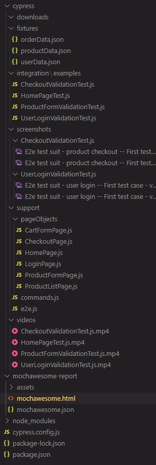

<a id="details"></a>
## __2.Implemented Details__

<a id="parametrizing"></a>

### __2.1 Parametrizing__ 

Implemented parametrizing in scripts with different browsers execution(chrome, firefox, edge, electron). To run tests with default headlessly mode during cypress run added "test" in scripts, to run tests with forcing the browser to be shown (headed mode) added "headtest" in scripts, to record tests runing in Cypress DashBoard added "recordDashBoardTest" (you'll need to updated the key from XXX to your key provided in Cypress dashboard).

From _package.json_:

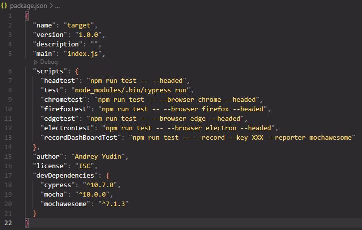

Implemented parameterizing the test Data from Json files using each command:

Example from _HomePageTest.js_:
```
productListPage.getProductTitles().each(($el, index, $list) => {
	const productTitle = $el.text()
	expect(productTitle.includes(data.product1.searchKey1, data.product1.searchKey2)).to.be.true
}).then(($list) => {
	expect($list).to.have.length(3)
})
```

<a id="pageobject"></a>

### __2.2 Page object mechanism__ 

Framework built using page object pattern to achieve the following goals for the project:
    - easy to maintain project;
    - easy readability if scripts;
    - reduce or eliminate duplicacy;
    - re-usability if code;
    - reliability.

For the each page created a separate page object class to store it's elements and methods.

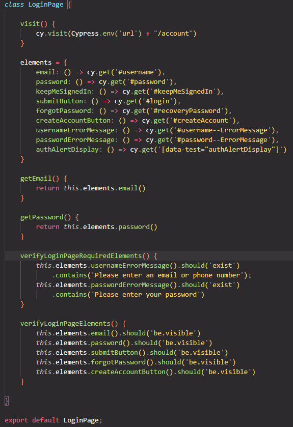


Example of test cases with using created page objects:

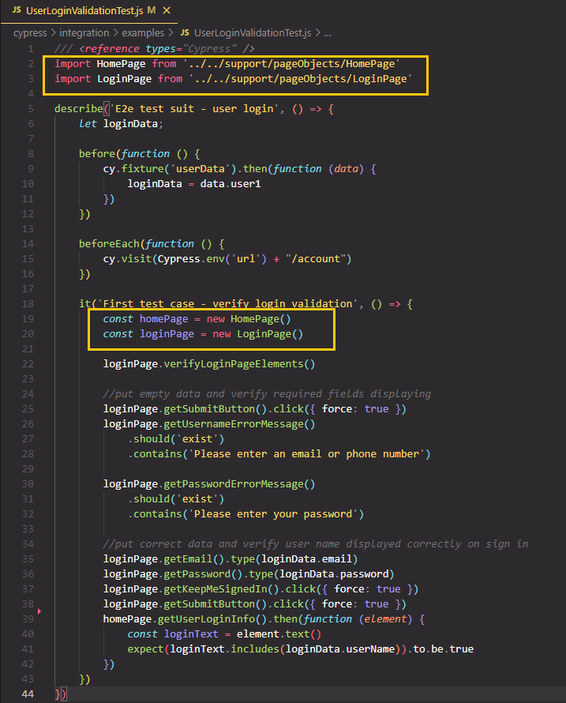

<a id="datadriven"></a>

### __2.3 Data driven concepts from fixtures__ 

Data driven approach (reading data files and storing input values into variables) is implemented by reading from fixtures. 

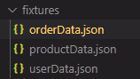

Fixtures enable data-driven automation in Cypress by saving the test data in JSON format:

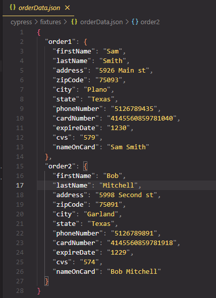

<a id="commands"></a>

### __2.4 Custom Cypress commands with Reusable methods__

Used default commands.js file to define or overwrite custom commands with reusable methods(full path cypress/support/commands.js), since it is loaded before any test files are evaluated via an import statement in the supportFile.

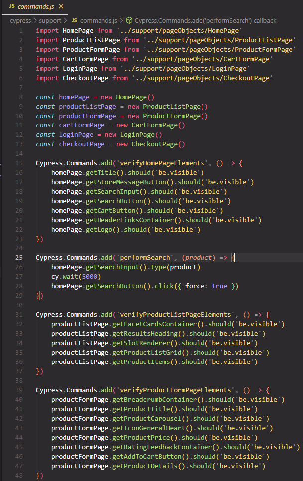

<a id="config"></a>

### __2.5 Configuration changes in Cypress.config.js__

 Created on the first Cypress launching default configuration was updated with specifying projectId required for Cypress Dashboard, specPattern path, screenshotsFolder, changing pageLoadTimeout(time to wait for page transition events) and defaultCommandTimeout (time to wait until most DOM based commands are considered timed out) to 10 seconds, mochawesome reporter as an alternative report for Cypress Dashboard, also was defined a global env url with adding the number of times as 1 to retry a failing test (retries).

 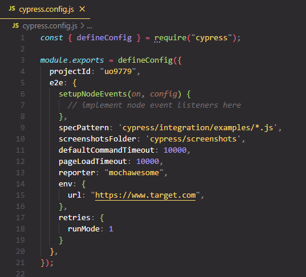

<a id="screenshots"></a>

### __2.6 Screenshots and video recording__

Cypress already comes with the ability to take screenshots, whether you are running via cypress open or cypress run, even in CI. Cypress will automatically capture screenshots when a failure happens during cypress run. Screenshots on failure are not automatically taken during cypress open.
Default path for Screenshots specified in cypress.config.js:
```
    screenshotsFolder: 'cypress/screenshots'
```
 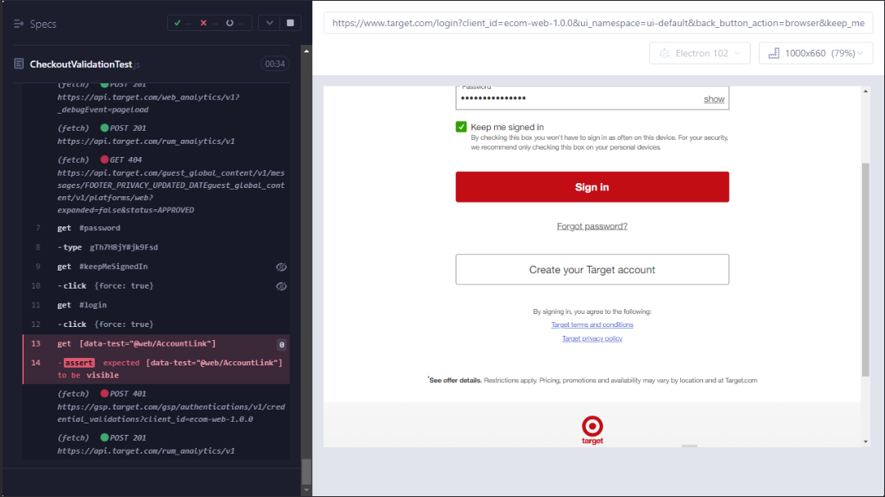

Cypress records a video for each spec file when running tests during cypress run. Videos are not automatically recorded during cypress open.
Videos are stored in the videosFolder which is set to cypress/videos by default.

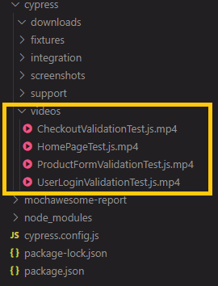

<a id="reports"></a>

### __2.7 Generating Reports__

Integrated Mochawesome report for local usage as an alternative to the deep reporting mechanisme available on using Cypress dashboard.
Cypress is bundled with Mocha, so any reports that can be generated for Mocha can also be utilized with Cypress.

Implementation in cypress.config.js:

```
    reporter: "mochawesome"
```

After execution is completed, the mochawesome-report folder gets generated within the Cypress project containing reports in html and json formats.

 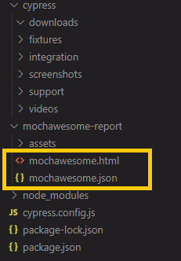

Right-click on the mochawesome.html report, select the Copy Path option, and open the path copied on the browser.

 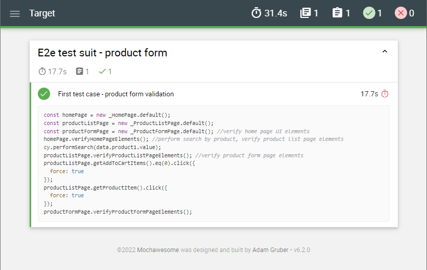